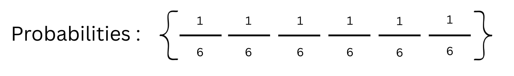
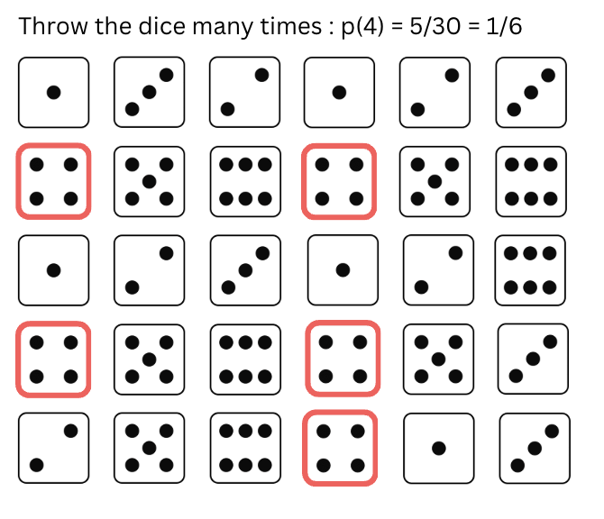
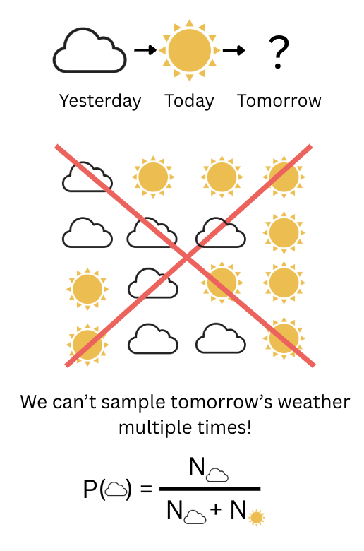

## Introduction

Let's take the classic example of the dice. When throwed the dice can take multiple values. We call the ensemble of possible scenarios the states. Each state is an exhaustive description of exactly one possible outcome.

Each state has a probability $p_{i}$ shows how likely the state $S_{i}$ is to occur.

In general let's denote the states:

$$States: \{S_{1},S_{2},...,S_{n}\}$$

And each state has a probability associtated with it:

$$Probabilities: \{p_{1},p_{2},...,p_{n}\}$$

The sums of all probabilities should sum up to 1:

$$\sum_{s}p_{s} = 1$$

## How to find the probabilities?

The first intuitive approach would be to throw the dice many times and record the outcomes :

This method of experimentally evaluating the probabilities is called the frequentist definition of probabilities.

Frequentist view :
**Probabilities is viewed as the long-run frequency of an event occuring in repeated trials or experiments**

While the frequentist approach is useful to measure a dice throw probability, it shows limitation, for example imagine we want to predict tomorrow's weather forecast :

As shown in this example, our problem cannot be resolved with a frequentist view.

Bayesian view:
**Probability is viewed as a subjective degree of belief or confidence**

When we say that tomorrow's weather will be cloudy with 70% probability, it represents our measure of confidence rather than the frequency.

## Fundamental Rules
In mathematics, probabilities follow the three axioms defined by Andrey Kolmogorov:

1. The probability of an event is a non-negative real number: 

$$\displaystyle P(E)\geq 0\qquad \forall E\in F$$

2. The probability that at least one elementary event in the sample space will occur is one: 

$$P({\textstyle \Omega }) = 1$$

3. Third axiom: The probability of any countable sequence of disjoint (i.e. mutually exclusive) events $$E_{1}, E_{2},E_{3},...$$
 is equal to the sum of the probabilities of the individual events: 
 
$$\displaystyle P\left(\bigcup _{i=1}^{\infty }E_{i}\right)=\sum _{i=1}^{\infty }P(E_{i}).$$

### Sources :

[1] [The Key Equation Behind Probability, YouTube Video](https://www.youtube.com/watch?v=KHVR587oW8I)

[2] [Probability axioms](https://en.wikipedia.org/wiki/Probability_axioms)