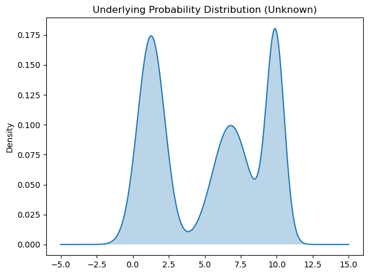
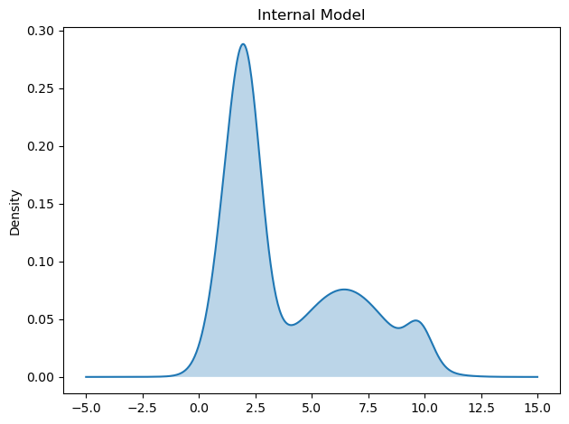
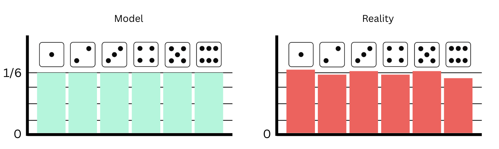
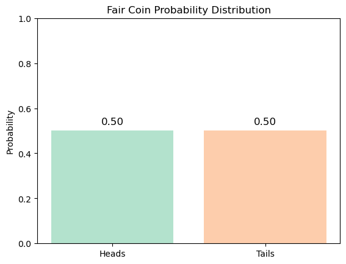
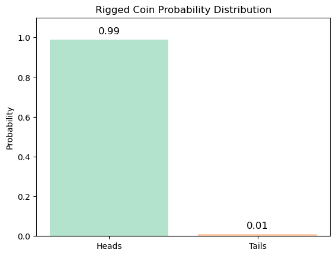

## Internal Models

Let's say the true probability distribution looks like this :

The issue is that we don't have access to this distribution as it may be too complex.

So we build an internal model (belief about the distribution) that looks like this :

While our internal model is not perfect, it may be sufficient to capture the most important aspects of the original distribution.

For example, a dice throw can be modeled as a simple uniform distribution, when in reality, the object might not be perfectly balanced or have a tiny imperfection, leading to sides appearing more than others. Also it may have a tiny probability to land on an edge or to break.

While our model is imperfect, our approximation is close enough for most purposes.

## Cross-Entropy

Now imagine that we are given a dice and throw it while believing in this model:

While in reality, the coin is rigged and the true underlying distribution is:

According to our model, the probability of having 10 consecutive heads is $$p(10\ Heads) = 0.5^{10} \approx 0.001$$
And the surprise is: $$h(10\ Heads) = log0.5^{-10} \approx 7$$

In reality, the probability of having 10 consecutive heads is $$p(10\ Heads) = 0.99^{10} \approx 0.9$$
And the surprise is: $$h(10\ Heads) = log0.99^{-10} \approx 0.1$$

**So the high surprise (7), is caused from believing in the wrong model.**

Cross Entropy is a function that gives us the average surprise you will get by observing a random variable governed by a distribution P, while believing in its model Q.

$$H({\color{#E67C73} P}, {\color{#87CEFA} Q}) = \sum_{s}^{\text{states}} {\color{#E67C73} p_s} \log \left( \frac{1}{ {\color{#87CEFA} q_s}} \right)$$

It is the same formula as entropy but instead of using $$p_{s}$$ from one single distribution we compute the surprise according to our model and we weight it by the probability from the true probability distribution.

The surprise can come from either believing in the wrong model or the incertainty of the process itself.

### Properties

When $${\color{#E67C73} P}={\color{#87CEFA} Q}$$, or when our model is perfect, the cross-entropy is equal to the entropy of $${\color{#E67C73} P}$$:

$$H({\color{#E67C73} P}, {\color{#87CEFA} Q}) = H({\color{#E67C73} P}, {\color{#E67C73} P}) = \sum_{s}^{\text{states}} {\color{#E67C73} p_s} \log \left( \frac{1}{ {\color{#E67C73} p_s}} \right) = H({\color{#E67C73} P})$$

---

For any model, the cross-entropy can never be lower than the entropy of the underlying probability distribution:

$$H({\color{#E67C73} P}, {\color{#87CEFA} Q}) \ge H({\color{#E67C73} P})$$

---

$$H({\color{#E67C73} P}, {\color{#87CEFA} Q}) \ne H({\color{#87CEFA} Q}, {\color{#E67C73} P})$$

The formula is asymmetric meaning that switching the distributions lead to different results

[1] [The Key Equation Behind Probability, YouTube Video](https://www.youtube.com/watch?v=KHVR587oW8I)