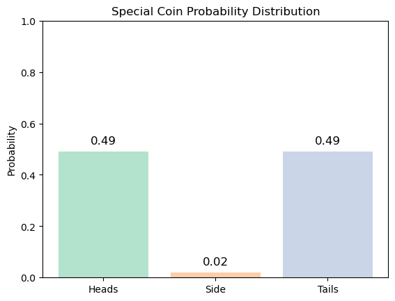

## Defining Entropy

Now that we have defined the surprisal factor, we can apply it to any discrete probability distributions:

**Entropy corresponds to the expected surprise of state in a distribution:**

$$H = \sum_{s}{p_{s}\log\left(\frac{1}{p_{s}}\right)}$$

## Example

Let's consider two coins, the first being a fair coin where each side has equal probability of 50% of occuring:

We can calculate its entropy by using the formula:

$$H = \sum_{s}{p_{s}\log\left(\frac{1}{p_{s}}\right)} = \frac{1}{2}log\left(\frac{1}{\frac{1}{2}}\right) + \frac{1}{2}log\left(\frac{1}{\frac{1}{2}}\right) = log\left(2\right) \approx 0.7 $$

Now imagine that there is a low probability (0.02%) of the coin falling to its side:

Again we can calculate the entropy:

$$H = \sum_{s}{p_{s}\log\left(\frac{1}{p_{s}}\right)} = \frac{49}{100}log\left(\frac{1}{\frac{49}{100}}\right) + \frac{2}{100}log\left(\frac{1}{\frac{2}{100}}\right)+ \frac{49}{100}log\left(\frac{1}{\frac{49}{100}}\right) = 0.8$$

As we can see the entropy of the second game is higher. Entropy is higher when more rare events occur because the average surprise has increase. The second game has more uncertainty packed into it.

[1] [The Key Equation Behind Probability, YouTube Video](https://www.youtube.com/watch?v=KHVR587oW8I)