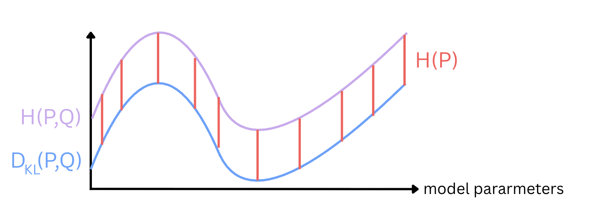

## Kullback-Leibler divergence

How can we quantify the difference between probability distribution $${\color{#E67C73} P}$$ and $${\color{#87CEFA} Q}$$, beyond the surprise inherent in $${\color{#E67C73} P}$$?

We can simply substract the entropy of our true distribution from our cross-entropy:

$$H({\color{#E67C73} P}, {\color{#87CEFA} Q}) - H({\color{#E67C73} P}) = \sum_{s} {\color{#E67C73} p_s} \log \left( \frac{1}{ {\color{#87CEFA} q_s}} \right) - \sum_{s} {\color{#E67C73} p_s} \log \left( \frac{1}{ {\color{#E67C73} p_s}} \right) = \sum_{s} {\color{#E67C73} p_s} \log \left( \frac{ {\color{#E67C73} p_s}}{ {\color{#87CEFA} q_s}} \right) = D_{\text{KL}}({\color{#E67C73} P}, {\color{#87CEFA} Q})$$

**The Kullback-Leibler divergence measures the extra surprise caused by believing in our model instead of the true distributions, beyond the uncertainty of the true distribution itself:**

## Use in Machine Learning

Many machine learning models, especially generative ones, try to approximate a probability distribution from its training data. In this case, **our machine learning model output (usually last layer) represents our internal model**, while our **training dataset represents the true distribution**. The goal is to be able to construct new examples when sampling this learned distribution.

To achieve this, we can use KL-Divergence as an objective function. Minimizing the KL-Divergence means that we want our model to fit the true distribution. But here comes a simple trick:

$$D_{\text{KL}}({\color{#E67C73} P}, {\color{#87CEFA} Q}) = H({\color{#E67C73} P}, {\color{#87CEFA} Q}) - H({\color{#E67C73} P})$$

Because here the term $$H({\color{#E67C73} P})$$ does not depend on our model $${\color{#87CEFA} Q}$$, and is fixed in our training data, it is treated as a constant, and minimizing the KL-Divergence is the same as minimizing the Cross-Entropy. Computing Cross-Entropy will be more efficient than computing the KL-Divergence. Thus, we directly optimize for the Cross-Entropy.

[1] [The Key Equation Behind Probability, YouTube Video](https://www.youtube.com/watch?v=KHVR587oW8I)