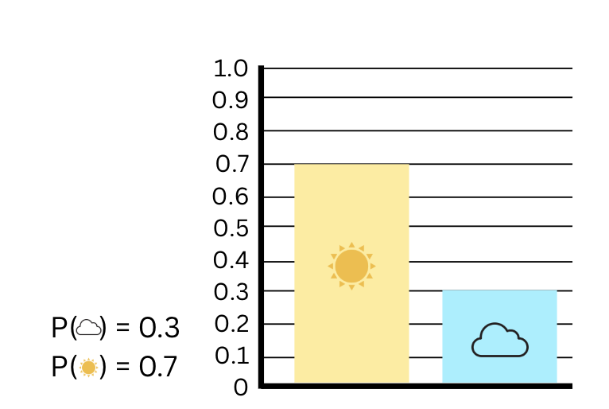
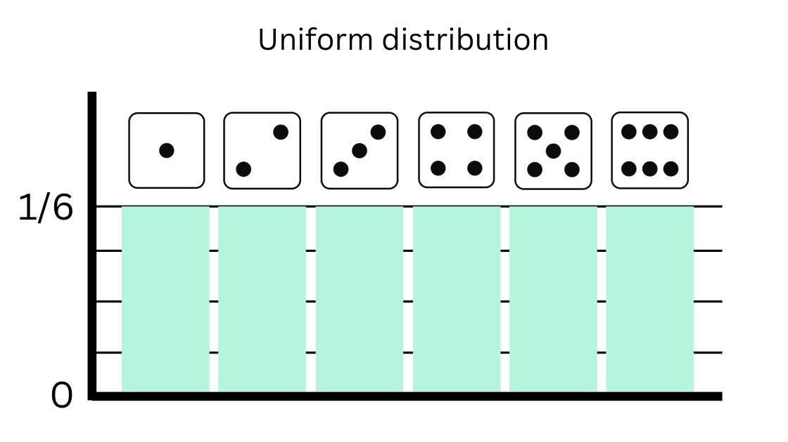
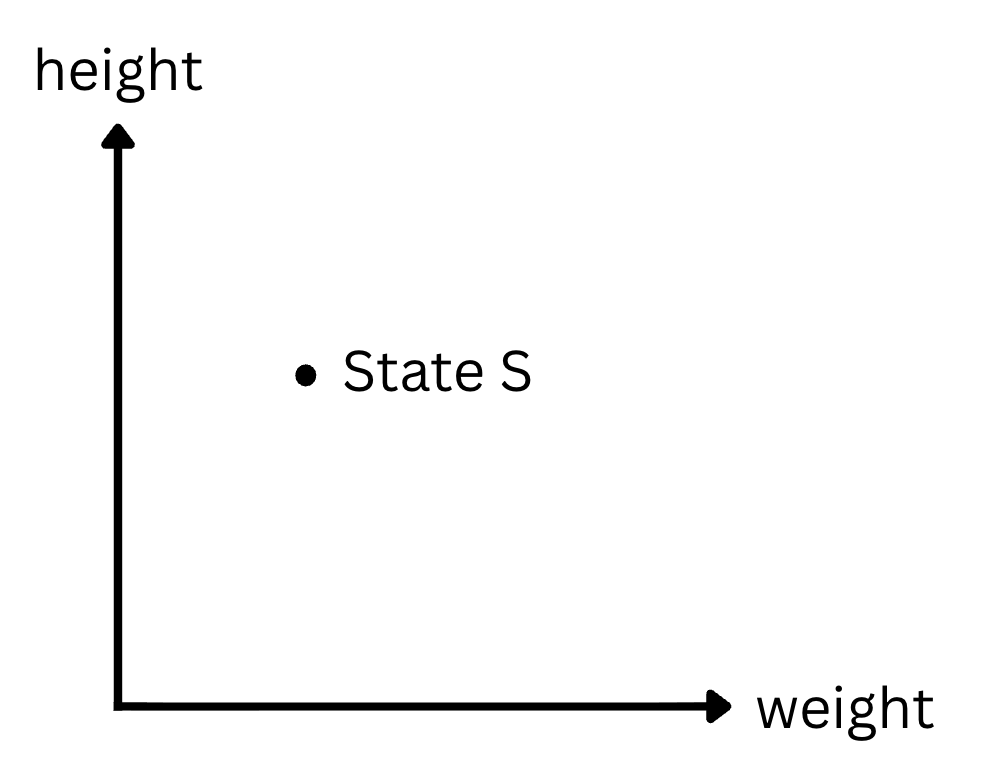

## Introduction

**The probability distribution is a function $$p_{s}$$ that maps the state $$S$$ to its probability.**

Because probabilities must sum up to 1, changing the output of the function for one state affects others.

## Common distributions

1. The **uniform distribution** maps all states with equal probability

2. The **gaussian distribution** or the bell curve, is able to represent a lot of different natural phenomenons, such as height distribution in a population.

Because it is a continuous function, the area under the curve must be equal to 1: $$\int_{s}{p(s)} = 1$$

## What about when we have more than one variable ?

We can represent each state in a 2D space, with a probability associated with it. 

**When states form an N-dimensional space, each point of this space (corresponding to one state) is associated with a probability value**

In generative models, we use **sampling** to generate new examples from a joint probability distribution.

[1] [The Key Equation Behind Probability, YouTube Video](https://www.youtube.com/watch?v=KHVR587oW8I)