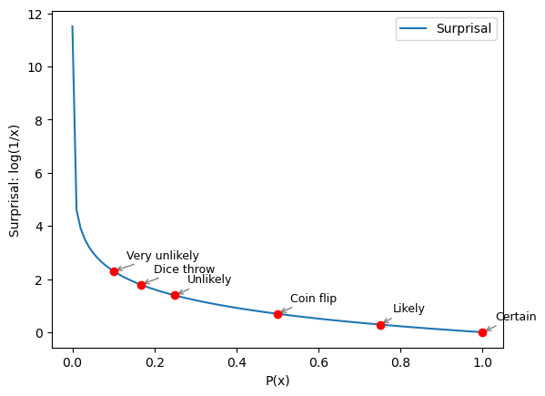

## Intuitive approach

Imagine that someone correctly predicts the result of a dice throw and of a coin toss. You know that the probabilities of selecting the correct answer for a dice throw is lower than for a coin toss because there is $p(X) = \frac{1}{6}$ chance of getting the right answer for the dice throw against $p(X) = \frac{1}{2}$ for the coin toss. You would me more surprise by the correct prediction of the dice throw because it is less likely to be correct.

## Defining surprisal

In information theory, a rare event carries more informational value than a very likely one. Ideally, we would want a formula that can quantify this surprisal, or information content factor. It is given by :

$$I(E) = log(\frac{1}{p(E)})$$

For very probable events, as the function approaches 1, the surprise is very low. For very rare events, as the function approaches 0, the surprise is very high.

When using the above formula to our initial problem, we can see that the surprisal formula successfuly captures the difference of surprise between our dice throw and coin toss.

[1] [The Key Equation Behind Probability, YouTube Video](https://www.youtube.com/watch?v=KHVR587oW8I)
[2] [Entropy (information theory)](https://en.wikipedia.org/wiki/Entropy_(information_theory))