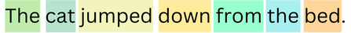
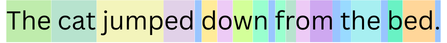

## Tokenization techniques

### Motivation

Before diving into the complex architecture of GPT-2, we need to understand the role of tokenization. As computers cannot make sense of text, we need to represent each unique character or word as a unique number. This unique number will then be fed to our neural language models. Our vocabulary consists of all pairs $(word, id)$.

> Why don't we just use character-level tokens like the classical encoding formats ASCII or UTF-8 ?
The motivation behind tokenization is to help the LLM learns meaningful representations of the words by pushing it to reason about them at a higher level. Indeed, humans rarely think about the characters composing the word when articulating a thought.

### Word-Level tokenization

This is the simplest form of tokenization, it maps entire words to a unique id. This is the tokenization used in Word2Vec.

<div style="display: flex; gap: 20px;justify-content: center;
align-items: center;">
  
</div>

### Byte-Pair Encoding

Originally, BPE (or Byte-Pair Encoding) is an algorithm used to compress text. The main motivation behind using BPE for neural language models is to reconstruct rare words using characters or sub-words [1]. Because the most atomic unit of vocabulary is a single character, this allow the model to reconstruct any word that is not directly present in its vocabulary.

Let's take the example where neither our Word-Level or BPE tokenizer has the word "jumped" in its vocabulary :

<div style="display: flex; gap: 20px;justify-content: center;
align-items: center; max-width: 700px;">
  
</div>

The Word-Level tokenizer is unable to process this word and will return the unknown token. The BPE tokenizer will reconstruct the word by merging every known pair. In this example, the vocabulary contains "jump" and "ed" as two distinct tokens. Consequently our word will be represented by these two tokens.

The algorithm starts by taking all the unique characters in the corpus. Then it merges the most frequent pairs until a vocabulary size is reached. During inference, this merging process is repeated until no further merge operation can be done.

#### Walking through the algorithm

I think that BPE is better explained through an example. To illustrate we will tokenize this single sentence :

```python
sentence = "The cat jumped down from the bed."
```

First we start by splitting every word of our corpus and separate the punctuation. Then we create a dictionary where each word as its frequency associated with it.

>The splitting rule for GPT-2 represents space as a special character, rendered as 'Ġ' and incorporate them to the beginning of the word that follows it.

```python
corpus = {'The': 1, 'Ġcat': 1, 'Ġjumped': 1, 'Ġdown': 1, 'Ġfrom': 1, 'Ġthe': 1, 'Ġbed': 1, '.': 1}
```

We start with a vocabulary that comprises of all single characters present in our corpus. We will expand this vocabulary at each iteration of our algorithm.

```python
vocabulary = ['u', 'h', 'w', 't', 'o', 'm', 'r', 'T', 'p', 'n', 'f', 'c', '.', 'e', 'b', ' ', 'j', 'd', 'Ġ', 'a']
```

If we apply our merging rules before running the algorithm, we just obtain a character level tokenization.

We split invidual words into single characters :

```python
{'The': ['T', 'h', 'e'],
 'Ġcat': ['Ġ', 'c', 'a', 't'],
 'Ġjumped': ['Ġ', 'j', 'u', 'm', 'p', 'e', 'd'],
 'Ġdown': ['Ġ', 'd', 'o', 'w', 'n'],
 'Ġfrom': ['Ġ', 'f', 'r', 'o', 'm'],
 'Ġthe': ['Ġ', 't', 'h', 'e'],
 'Ġbed': ['Ġ', 'b', 'e', 'd'],
 '.': ['.']}
```
**Main loop: repeat until the vocabulary has reached a set size**
We compute the most frequent pairs, first by computing the pairs in a single word, then multiplying it by the frequency of this word and finally adding the counts of similar pairs together :

```python
# Top 10 most frequent pairs

('h', 'e'): 2
('e', 'd'): 2
('T', 'h'): 1
('Ġ', 'c'): 1
('c', 'a'): 1
('a', 't'): 1
('Ġ', 'j'): 1
('j', 'u'): 1
('u', 'm'): 1
('m', 'p'): 1
```

We add the most frequent pair to the vocabulary :

```python
vocabulary = ['u', 'h', 'w', 't', 'o', 'm', 'r', 'T', 'p', 'n', 'f', 'c', '.', 'e', 'b', ' ', 'j', 'd', 'Ġ', 'a', 'he']
```

We apply the merge rule to our splits:

```python
{'The': ['T', 'he'],
 'Ġcat': ['Ġ', 'c', 'a', 't'],
 'Ġjumped': ['Ġ', 'j', 'u', 'm', 'p', 'e', 'd'],
 'Ġdown': ['Ġ', 'd', 'o', 'w', 'n'],
 'Ġfrom': ['Ġ', 'f', 'r', 'o', 'm'],
 'Ġthe': ['Ġ', 't', 'he'],
 'Ġbed': ['Ġ', 'b', 'e', 'd'],
 '.': ['.']}
```

**Repeat the loop**

After running the loop for 10 iterations we obtain :

```python
vocabulary = ['u', 'h', 'w', 't', 'o', 'm', 'r', 'T', 'p', 'n', 'f', 'c', '.', 'e', 'b', 'j', 'd', 'Ġ', 'a', 'he', 'ed', 'The', 'Ġc', 'Ġca', 'Ġcat', 'Ġj', 'Ġju', 'Ġjum', 'Ġjump']
```

We can visualize our tokenizer in action in our original sentence :

<div style="display: flex; gap: 20px;justify-content: center;
align-items: center;">
  
</div>

Note that the original GPT-2 differs from our example as it works directly at the byte level (UTF-8 encoding).

[1] [Neural Machine Translation of Rare Words with Subword Units](https://arxiv.org/pdf/1508.07909)