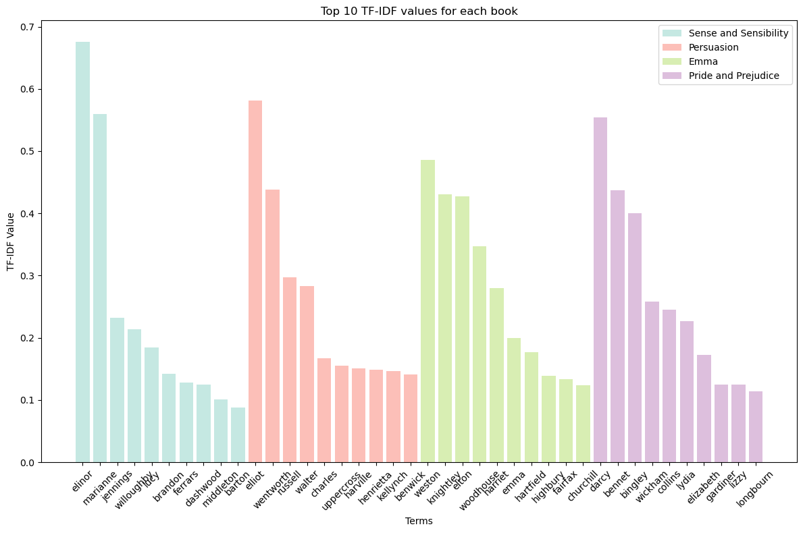
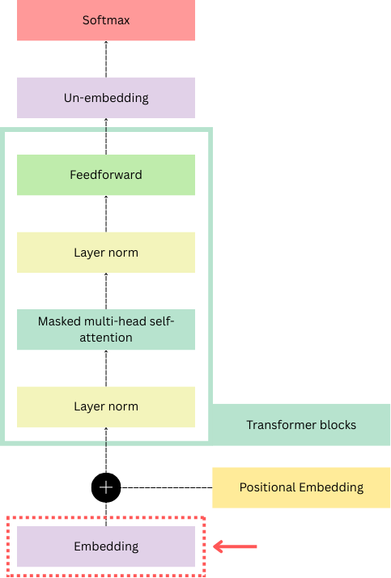

## Word Embeddings : Quick Recap

Representing words as vectors is not new and has been one of the most successful way of making sense of large documents and representing the semantic relationship of words in machine learning.

### TF-IDF
An early technique, TF-IDF focused on simple word counting in documents :

$$
w_{i,j} = tf_{i,j}*log(\frac{N}{df_{i}})
$$

Where $$tf_{i,j}$$ represent the number of times the term i appears in the document j, $${N}$$ is the number of documents in the corpus and $$df_{i}$$ is the number of documents containing the term i.

This method allows to retrieve the terms that are uniquely present for each document. This can be particularly useful when trying to capture the unique features of each document. 

### Example

Let's apply TF-IDF with a corpus composed of four books from Jane Austen :

<div style="display: flex; gap: 20px;justify-content: center;
align-items: center;">
  
</div>

> Note : We use preprocessing techniques, to remove stop words, punctuations and special characters as well as converting every word to lowercase before applying the algorithm.

We find that the most important words are character names as they are common in their respective book while not appearing in the other authors' books.

However, this method shows limits on how useful the representations of words could be. While this allowed to capture discriminative words and make sense of documents, the encoding of words was very inefficient due their sparcity, high encoding dimension and high storage requirements.

### Word2Vec

The second most important innovation was the dense vector representations of words introduced in word2vec, computed using the Skip-Gram method [1]. Each word is mapped to a dense vector. The vectors corresponding to words can be represented as a matrix of size (vocabulary_length, embedding_dimension) where each slice correspond to a unique mapping of a single word. 

The algorithm follows the distributional hypothesis, that states that the semantic meaning of words can be infered by words present in its context window. To compute our embeddings Mikolov and al. propose to optimize for this objective function :

$$
\log \sigma({v'_{w_O}}^\top v_{w_I}) + \sum_{i=1}^{k} \mathbb{E}_{w_i \sim P_n(w)} \left[ \log \sigma(-{v'_{w_i}}^\top v_{w_I}) \right]$$

> While this might look scary at first, the intrinsic logic is very intuitive. The first term $$\log \sigma({v'_{w_O}}^\top v_{w_I})$$ is computing how close our center word and context word are from eachother. Then $$\sum_{i=1}^{k} \mathbb{E}_{w_i \sim P_n(w)} \left[ \log \sigma(-{v'_{w_i}}^\top v_{w_I}) \right]$$ sample k number of negative examples (words that are not in our context window) and compute how close our center word is from these negative examples. 

During backpropagation, our embeddings are modified to bring similar words close to eachother in the vector space while pushing negative examples away. The resulting embedding matrix has interesting properties that we can visualize:


## Introducing the GPT Embedding Layer

<div style="display: flex; gap: 20px;">
  
  <div>
    <p>This is the first layer of the GPT architecture. It maps every token of the vocabulary to a dense vector. While other architectures like word2vec allowed to capture the semantic meaning of words, in GPT or BERT the interpretability of this first layer is limited as we use sub-word tokenizations techniques like BPE or WordPiece. Indeed, words can be split between multiple subtokens which may difficultly interpretable before being passed to the next layers. Hence, it would be better to see these vectors as the backbone, that will be refined through later layers to capture positional and contextual meaning. </p>
  </div>
</div>

### Input Sequence

The embedding layer act as a lookup table. Each token in the vocabulary is mapped to a column of the embedding layer.

The embedding weights are represented as a tensor:

$$
W_{E} = \underbrace{\begin{bmatrix} w_{1,1} & w_{1,2} & \dots & w_{1,d} \\ w_{2,1} & w_{2,2} & \dots & w_{2,d} \\ \vdots & \vdots & \ddots & \vdots \\ w_{V,1} & w_{V,2} & \dots & w_{V,d} \end{bmatrix}}_{\text{Vocab Size (V)}} \left. \vphantom{\begin{matrix} w_{1,1} \\ w_{2,1} \\ \vdots \\ w_{V,1} \end{matrix}} \right\} \text{Embedding Dimension (d)}
$$

To get the vector corresponding to our token we simply slice the column from the embedding matrix at our token id. In PyTorch, slicing a tensor allows the gradients to propagate during the optimization phase. Indeed, we can see each value in our tensor being passed by reference.

Let's say we want to get the embedding for the word "cat" which corresponds to the token 1 in our vocabulary. Then we obtain its vector by taking the second column in the embedding matrix;

$$\begin{array}{r cccc c}
\mathbf{e}_{cat} : & 
\left[ \begin{array}{c} w_{1,1} \\ w_{2,1} \\ \vdots \\ w_{d,1} \end{array} \right. \!\! &
\begin{array}{c} \color{teal}{w_{1,2}} \\ \color{teal}{w_{2,2}} \\ \color{teal}{\vdots} \\ \color{teal}{w_{d,2}} \end{array} \!\! &
\begin{array}{c} \dots \\ \dots \\ \ddots \\ \dots \end{array} \!\! &
\left. \begin{array}{c} w_{1,n} \\ w_{2,n} \\ \vdots \\ w_{d,n} \end{array} \right] &
\rightarrow 
\begin{bmatrix} \color{teal}{w_{1,2}} \\ \color{teal}{w_{2,2}} \\ \vdots \\ \color{teal}{w_{d,2}} \end{bmatrix} \\[7ex]
\text{tokens:} & 0 & \color{teal}{1} & \dots & n & 
\end{array}$$

The resulting vector corresponds to a dense representation of our token.

## Code

My explanation will follow Andrej Karpathy's mingpt implementation. The following code snippet is extracted from the model python code and shows how the embedding layer is initialized:

```python
class GPT(nn.Module):
    @staticmethod
    def get_default_config():
        [...]
        C.n_embd =  None
        # these options must be filled in externally
        C.vocab_size = None
        [...]
        # dropout hyperparameters
        C.embd_pdrop = 0.1
        [...]

    def __init__(self, config):
        super().__init__()
        assert config.vocab_size is not None
        assert config.block_size is not None
        [...]
        self.transformer = nn.ModuleDict(dict(
            wte = nn.Embedding(config.vocab_size, config.n_embd),
            [...]
        ))
    
    def forward(self, idx, targets=None):
        [...]
        # forward the GPT model itself
        tok_emb = self.transformer.wte(idx) # token embeddings of shape
        [...]
```

### Sources

[1] [Efficient Estimation of Word Representations in Vector Space](https://arxiv.org/pdf/1301.3781)

[2] [Transformers, the tech behind LLMs | Deep Learning Chapter 5](https://www.youtube.com/watch?v=wjZofJX0v4M)

[3] [A statistical interpretation of term specificity
and its application in retrieval](https://www.staff.city.ac.uk/~sbrp622/idfpapers/ksj_orig.pdf)