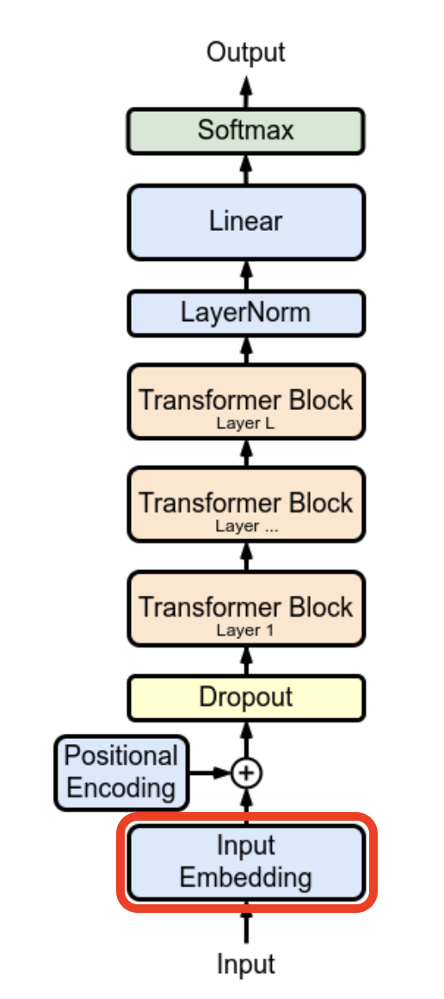

# Word Embeddings : Quick Recap

Representing words as dense vectors is not new and has been one of the most successful way of making sense of large documents and representing the semantic relationship of words in machine learning. 

One of the most early technique, TF-IDF focused on simple counting of words in documents:

$$w_{i,j} = tf_{i,j}*log(\frac{N}{df_{i}})$$

Where $tf_{i,j}$ represent the number of times the term i appears in the document j, ${N}$ is the number of documents in the corpus and $df_{i}$ is the number of documents containing the term i.

This method allowed to retrieve the terms that are uniquely important for each document. This can be particularly useful when trying to capture the unique features of each document. For example when applying this technique to a collection where each book of an author is a document we can get:

We find that the most important words are character names as they are common in thei respective book while not appearing in the other authors" books.

However, this method showed limits on how useful the representations of words could be. While this allowed to capture discriminative words and make sense of documents, the encoding of words was very inefficient due their sparcity, high encoding dimension and high storage requirements.

The second most important innovation was the dense vector representations of words introduced in word2vec, computed using the Skip-Gram method [1]. Each word is mapped to a dense vector. The vectors corresponding to words can be represented as a matrix of size (vocabulary_length, embedding_dimension) where each slice correspond to a unique mapping of a single word. 

The algorithm follows the distributional hypothesis, that states that the semantic meaning of words can be infered by words present in its context window. To compute our embeddings Mikolov and al. propose to optimize for this objective function:

$$\log \sigma({v'_{w_O}}^\top v_{w_I}) + \sum_{i=1}^{k} \mathbb{E}_{w_i \sim P_n(w)} \left[ \log \sigma(-{v'_{w_i}}^\top v_{w_I}) \right]$$

While this might look scary at first, the intrinsic logic is very intuitive. The first term $\log \sigma({v'_{w_O}}^\top v_{w_I})$ is computing how close our center word and context word are from eachother. Then $\sum_{i=1}^{k} \mathbb{E}_{w_i \sim P_n(w)} \left[ \log \sigma(-{v'_{w_i}}^\top v_{w_I}) \right]$ sample k number of negative examples (words that are not in our context window) and compute how close our center word is from these negative examples. 

During backpropagation, our embeddings are modified to bring similar words close to eachother in the vector space while pushing negative examples away. The resulting embedding matrix has interesting properties that we can visualize:

# Embedding Layer

  
  

    <h3>The embedding layer</h3>
    
This is the first layer of the GPT architecture. It maps every token of the vocabulary to a dense vector. While other architectures like word2vec allowed to capture the semantic meaning of words, in GPT or BERT the interpretability of this first layer is limited as we use sub-word tokenizations techniques like BPE or WordPiece. Indeed, words can be split between multiple subtokens which may difficultly have any meaning before being passed to the next layers. Hence, it would be better to see this layer has the backbone of the model, that will be refined throught later layers and capture positional and contextual meaning. 

  

### Input Sequence

This layer takes a one hot vector as input. Each token in the vocabulary is mapped to an index of the embedding layer.

$$\mathbf{x}_{cat} = \begin{bmatrix} 0 \\ 1 \\ 0 \\ 0 \\ 0 \end{bmatrix}$$

The embedding weights:

$$W_{E} = \underbrace{\begin{bmatrix} w_{1,1} & w_{1,2} & \dots & w_{1,d} \\ w_{2,1} & w_{2,2} & \dots & w_{2,d} \\ \vdots & \vdots & \ddots & \vdots \\ w_{V,1} & w_{V,2} & \dots & w_{V,d} \end{bmatrix}}_{\text{Vocab Size (V)}} \left. \vphantom{\begin{matrix} w_{1,1} \\ w_{2,1} \\ \vdots \\ w_{V,1} \end{matrix}} \right\} \text{Embedding Dimension (d)}$$

Multiplying a one hot vector and a matrix is the same as taking its column as the index of the one.

$$
\mathbf{e}_{cat} = 
\begin{bmatrix} 
w_{1,1} & \color{red}{w_{1,2}} & w_{1,3} & w_{1,4} & w_{1,5} \\
w_{2,1} & \color{red}{w_{2,2}} & w_{2,3} & w_{2,4} & w_{2,5} \\
\vdots & \color{red}{\vdots} & \vdots & \vdots & \vdots \\
w_{d,1} & \color{red}{w_{d,2}} & w_{d,3} & w_{d,4} & w_{d,5}
\end{bmatrix}
\begin{bmatrix} 0 \\ \mathbf{\color{red}{1}} \\ 0 \\ 0 \\ 0 \end{bmatrix} 
= \begin{bmatrix} \color{red}{w_{1,2}} \\ \color{red}{w_{2,2}} \\ \vdots \\ \color{red}{w_{d,2}} \end{bmatrix}
$$

The resulting vector correspond to a dense representation of our token. Usually we can understand these as capturing some semantic meaning.

### Sources

[1] [Efficient Estimation of Word Representations in Vector Space](https://arxiv.org/pdf/1301.3781)
[2] [Transformers, the tech behind LLMs | Deep Learning Chapter 5](https://www.youtube.com/watch?v=wjZofJX0v4M)