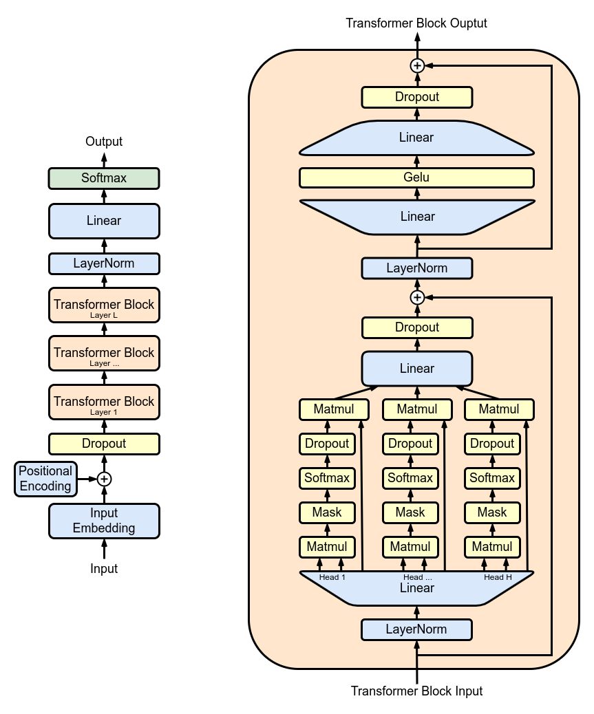

# Introduction

This blog will walk you through each parts needed to understand complex deep learning architectures.

## 1. The GPT Architecture

  
  

    <h3>Introducing the GPT Architecture</h3>
    
This section will go in depth into the components of the original GPT architecture. You will learn about word embeddings, positional encoding, dropout layers, the transformer block, normalisation layers, linear layer and final prediction using softmax.

  

