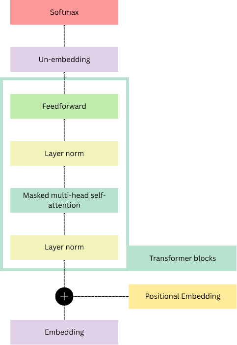

# Introduction

This blog will walk you through each parts needed to understand complex deep learning architectures.

## 1. The GPT-2 Architecture
 

  
  

    

    This section will go in depth into the components of the original GPT-2 architecture. You will start by learning about the different tokenization techniques. Then you will understand why we chose to represent tokens as vectors. You will follow the process that allows this vector to undergo a transformation that will make it to capture positional information and its contextual meaning until the end of the architecture.
    

  

